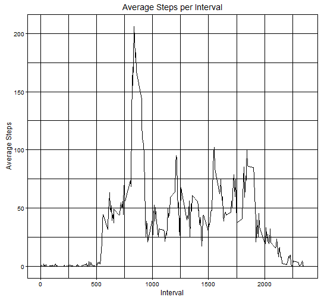
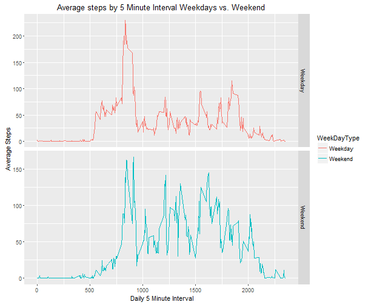

Submited by Piers Brew Feb. 14, 2016

## Loading and preprocessing the data
### Load the libraries needed for this project
Note you may need to install the ggplot2 package before knitting this file 


```r
library(ggplot2)
```

### pre-process the data
This code will unzip the data set extracting a csv file.
The csv "activities.csv" contains measurement of the number of steps taken in 5 minute intervals throught a period of 2 months in 2012. In this project we will perform some basic analysis of that data set.
Once the csv is extracted we read it into a data frame, then add additional dimensional information including whether the measurement day is a weekday or weekend.


```r
zipfile <- "activity.zip"
unzip(zipfile, exdir = "data")

activityfile <-"data/activity.csv"

activities <- read.csv(activityfile, header=TRUE, na.strings = "NA")

activities$date <- as.Date(activities$date)

activities$DayOfWeek <- weekdays(activities$date)

weekend <- activities$DayOfWeek %in% c("Saturday","Sunday")

activities$WeekDayType <- "Weekday"
activities$WeekDayType[weekend] <- "Weekend"
activities$steps <- as.numeric(activities$steps)
```


## What is mean total number of steps taken per day?
First we aggregate the number of steps taken per day, then show the mean and median of steps taken.


```r
stepsPerDay <- aggregate(steps~date,data=activities ,FUN ="sum")
meanSteps <- as.integer(mean(stepsPerDay$steps))
medianSteps <- as.integer(median(stepsPerDay$steps))
```
#### Mean of steps per day: 10766
#### Median of steps per day: 10765


### Histogram of the total steps per day

```r
hist(stepsPerDay$steps, col = "green", xlab = "Total Steps", 
     main = "Histogram of Total Steps Per Day")

rug(stepsPerDay$steps, col = "blue")
```


## What is the average daily activity pattern?
Here is a time series plot of the daily activity pattern. Calculated by averaging the number of steps taken at each interval accross all days. This code will graph the steps per interval, then calculate the interval with the highets average number of steps.

Note: The aggregate function will ignore NA values.  


```r
avgByInterval <- aggregate(steps~interval, data=activities, FUN="mean")
colnames(avgByInterval) <-c("Interval","AverageSteps")
IvlWithHighest <- avgByInterval[which.max(avgByInterval$AverageSteps),]
Interval <-IvlWithHighest[[1,1]]
AverageSteps <- as.integer(IvlWithHighest[[1,2]])

ggplot(aes(x=Interval, y=AverageSteps), data=avgByInterval)+geom_line()+
        xlab("Interval")+ylab("Average Steps")+
        ggtitle("Average Steps per Interval")+
        theme_linedraw()
```



#### Interval 835 has the highest average number of steps.
#### Average steps during that interval : 206

## Imputing missing values
#### Imputing will be done by replacing values for a given interval with the mean for that interval
This code locates the missing values, and returns a count. Missing values are then replaced with the mean (as an integer) for the corresponding interval.


```r
missing <- is.na(activities$steps)
missingCount <- sum(missing)

MissingIntervals <- activities$interval[missing]
Imputed <- lapply(MissingIntervals,  FUN = function(x){ 
        intervalToUse <- as.integer(x)
        avgByInterval$AverageSteps[avgByInterval$Interval == intervalToUse]
        })
activities$steps[missing] <-as.integer(Imputed)
```

2304 records had no step counts recorded. Missing values were replaced by the mean for the corresponding interval


### New histogram with imputed values included


```r
hist(stepsPerDay$steps, col = "green", xlab = "Total Steps", main = "Histogram of Total Steps Per Day Imputed Values")
rug(stepsPerDay$steps, col = "blue")
```


## Are there differences in activity patterns between weekdays and weekends?
### This section uses the Weekday type attribute added to the data set during pre-processing
The code first aggregates the data by weekday type then by interval - we use a facet graph to help highlight the differences.

```r
WeekDayvsWeekend <- aggregate(steps~interval+WeekDayType ,data=activities ,FUN ="mean")
ggplot(aes(x=interval, y = steps), data=WeekDayvsWeekend) + 
        geom_line(aes(color = WeekDayType))+facet_grid(WeekDayType~., scales = "free" ) +
        xlab(" Daily 5 Minute Interval") + ylab("Average Steps") + 
        ggtitle("Average steps by 5 Minute Interval Weekdays vs. Weekend")
```



The graphs shows the difference in activity level measured in steps - weekdays show a high level of activity early on followed by low activity levels for the remainder of the day. Weekends show a more sustained level activity throught the day, with the first high level activity starting later than during weekdays.

